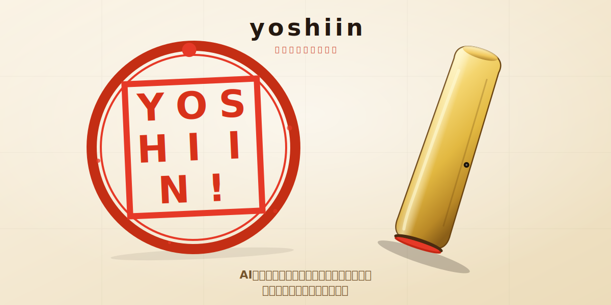

<p align="center">
  
</p>

<h1 align="center">yoshiin</h1>

<p align="center">
  <strong>AIエージェントが作った素敵なプランを、気持ちよく承認しましょう！</strong>
</p>

---

AIエージェントが出してくれる、あの素晴らしいプラン。
じっと眺めて、あなたはこう思うはずです。

> 「完璧だ。でも、`y` を押して Enter するだけでは、どうも儀式感が足りない。」

そう、そこに必要なのは**ハンコ**です。

`yoshiin` はメニューバーに住み着く、小さな捺印アプリです。
トレイの `印` をクリックすれば画面全体がハンコモードに切り替わり、カーソルは立派な象牙のハンコに変身。
承認したい場所で **ズン** と押せば、事前に登録しておいた判子ワードが、いま開いているアプリに勝手に送信されます。

Claude Code でも、Codex でも、ウェブフォームでも。
AIに「承認」を伝えるすべての瞬間に、日本人の魂を。

## 特徴

- 🎯 **5つまで判子ワードを登録** — `承認` `了解` `LGTM` `会社実印` `GMOペパボ株式会社` など、気分に合わせて切り替え
- 🖼 **メニューバーから一瞬で呼び出し** — トレイの `印` をクリックするだけ
- 🔴 **本物っぽい捺印アニメーション** — カーソルが象牙色のハンコに変身、振り下ろすと朱肉の痕が画面に残る
- ⚡ **ターミナル向け Enter 送信オプション** — Claude Code や Codex にプランをそのまま承認できます
- 🇯🇵 **完全日本語UI** — 日本人のための、AIが書いた判子アプリ
- 📐 **フレキシブルな印面** — 1文字から最大10文字まで、文字数に応じて印面のレイアウトが自動調整

## インストール

```bash
git clone https://github.com/Sangun-Kang/yoshiin.git
cd yoshiin
npm install
npm start
```

### macOSの方へ

初回起動時に「アクセシビリティ」権限が求められます。
`システム設定 > プライバシーとセキュリティ > アクセシビリティ` で `Electron`（もしくはビルド済みの `yoshiin`）を有効にしてください。
これがないと、他のアプリにキー入力を送れません。ハンコは押せますが、承認は届きません。悲しい。

### Windowsの方へ

`koffi` 経由で `user32.dll` を叩いてキー入力を送ります。特別な権限設定は不要です。

### Linuxの方へ

…ごめんなさい。捺印アニメーションは動きますが、キー送信はまだ実装されていません。
PR、お待ちしております。

## 使い方

1. メニューバーの `印` をクリック → コントロールパネルが出現
2. 最大5つまで判子ワードを入力（例: `承認` `了解` `GMOペパボ株式会社`）
3. 使いたい判子を選んで、**`発動`** ボタンを押す
4. 画面全体が捺印モードに突入。カーソルが立派なハンコに
5. 承認したい場所でクリック → **ズン**
6. 飽きたら `Esc` で終了

### Enter を押すかどうか

コントロールパネルの `スタンプ後に Enter を送信（ターミナル用）` チェックボックスで切り替えられます。

- **OFF（デフォルト）**: テキストが入力されるだけ。自分のタイミングで送信したい時に
- **ON**: 判子を押したら即 Enter。Claude Code や Codex でプランを一気に承認したい時に

テキストフィールドで誤爆したくないので、デフォルトは OFF にしてあります。

## なぜ作った？

AIエージェントが出してくれるプランは、だいたい正しいです。
でも、無言で `y` と打って承認するのは、どうにも味気ない。

日本の会社では、なにか大事なことを決める時、判子を押します。
あの「ズン」という音、朱色の丸い跡、机の上でクルッと回す動作。
あれがあるからこそ、「決めたぞ」という気持ちになれるのです。

だから作りました。AIと一緒に働く時代にも、ちゃんとした儀式を。

## ロードマップ

- [x] 初回リリース 🥳
- [x] macOS / Windows 対応
- [x] 完全日本語UI
- [x] 文字数に応じた印面レイアウト自動調整
- [ ] Linux対応（どなたか…！）
- [ ] 却下用の **黒い反対印鑑**
- [ ] 上司の承認ボイスを再生するモード
- [ ] 木目・象牙・チタン・翡翠など判子素材の切り替え
- [ ] 承認履歴をブロックチェーンに記録
- [ ] Anthropicからの停止命令 📜

## 謝辞

アイディアの着想は [badclaude](https://github.com/GitFrog1111/badclaude) から。
あちらは鞭で叩き、こちらは判子で押す。
どちらも AI との健全な関係を保つために必要な道具です。

## ライセンス

MIT
